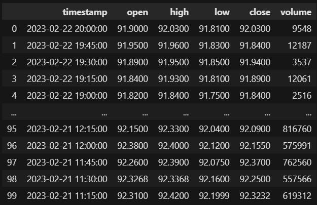
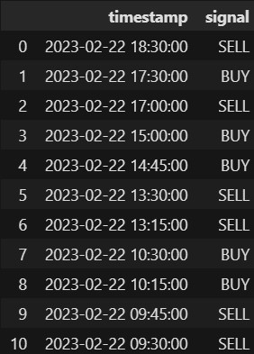
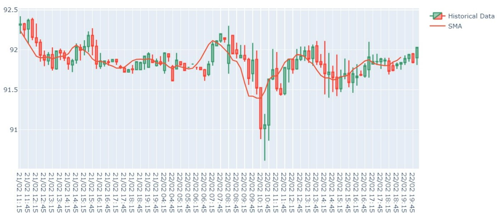

# <p align="center">STOCKS DATA ANALYSIS</p>

- Real time stocks data using alpha vantage api



- Stock data analysis using Numpy and Pandas library

- Buy / Sell indicator for stocks with timestamps



- Candlestick Graph using pyalgotrading library




## How to Run the code on your system ?

To run the notebook, you need to have Python installed on your machine. If you don't have it installed, you can follow the instructions [here](https://www.geeksforgeeks.org/download-and-install-python-3-latest-version/) to install it.

1. Clone the repository:

```CMD
git clone https://github.com/anshumannandan/AlgoBulls_Assignment.git
```

2. Navigate to the project directory

```CMD
cd Stocks_Data_Analysis
```

3. Install, Create and activate a virtual environment:

```CMD
pip install virtualenv
virtualenv venv
venv/scripts/activate
```

4. Install the dependencies: 

```CMD
pip install -r requirements.txt
```

5. Run the following command to run jupyter notebook

```CMD
jupyter notebook
```

This will open a browser instance with the jupyter interface displaying current directory structure

6. Navigate to the notebook by selecting analysis.ipynb

7. From the menu bar select Restart & Run All
